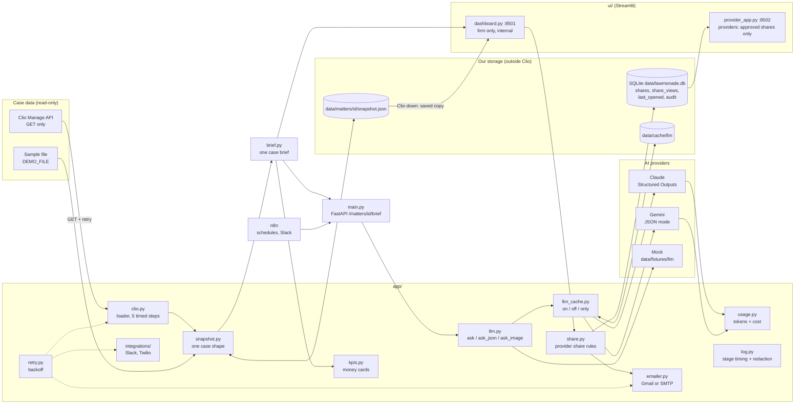

# Law-monade: architecture

Law-monade reads one personal-injury case **read-only** from Clio Manage. It does two things with it:
1. Gives the firm's team a one-screen case brief and timeline, where every fact links back to its source in Clio.
2. Lets an attorney share an approved, read-only update with a treating medical provider.

## Diagram



Data moves one way: **Clio → snapshot → screens**. Nothing in the app writes to Clio. Everything we create (share links, views, audit log, saved AI answers) lives in our own storage.

## Components

Each component can be swapped, can be tested on its own, and is configured from `.env` or a `run.sh` flag.

| Component | Input → Output | Can be swapped for | Config | Tests |
|---|---|---|---|---|
| `clio.py` loader | matter search → snapshot, in 5 progress steps | sample file, another case system (Filevine, …) | `CLIO_*` | `test_clio_links`, `test_retry` |
| `snapshot.py` | Clio or sample data → one case shape; latest + dated copies (`SNAPSHOT_KEEP`); find a saved copy; purge | SQLite/Postgres store | `SNAPSHOT_DIR`, `DEMO_FILE` | `test_snapshot_fallback` |
| `brief.py` | snapshot → cards (+ corrections, review status), lien status, counts; never writes | — | — | `test_brief` |
| `kpis.py` | snapshot → money cards, each with source + Exact/Calculated/Check | — | `config/fields.yaml` (field names per firm) | `test_kpis` |
| `share.py` + `store.py` | snapshot + attorney choices → frozen share (task notes opt-in, range not billed amount), 24-byte token, expiry; SQLite with numbered migrations, WAL, append-only audit | Postgres; signed links | `SHARE_LINK_DAYS`, `PUBLIC_URL` (provider portal) | `test_share`, `test_store` |
| `emailer.py` | to, subject, text → sent email (link only, never case details) | SMTP, SendGrid | `EMAIL_*`, `SMTP_*` | — |
| `llm.py` | prompt (+ Pydantic schema) → text or a checked object | any provider with JSON output | `--llm anthropic\|gemini\|mock`, `--model` | `test_llm_mock` |
| `llm_cache.py` | (provider, model, schema, prompt) → saved answer | Redis | `--cache on\|off\|only` | `test_llm_cache` |
| `usage.py` | tokens per call → log line + totals (cost per case) | provider billing export | `LLM_PRICE_*_PER_MTOK` | `test_llm_mock` |
| `retry.py` | function + "safe to repeat?" → result, or the original error | `tenacity` | defaults in code (3 tries, 10 s cap) | `test_retry` |
| `log.py` | events → one line per stage, secrets masked | JSON logs → Datadog etc. | `--log-level` | `test_log` |
| `grounding.py` | AI quote + page words → verified / needs_review / hallucination | — | `--ocr-threshold` | `test_smoke` |
| `ui/` | dashboard (firm, :8501) and provider portal (:8502, approved shares only) | any front end (calls `brief.build`) | `--port` | manual |
| `main.py` + n8n | HTTP → app functions; schedules → Slack | cron | `SLACK_WEBHOOK_URL` (env only) | `/health` |

## Reliability

**Retries** (`app/retry.py`): exponential backoff (0.5 s, 1 s, 2 s plus a little randomness, or the server's `Retry-After`), capped at 10 s total so the screen never hangs.

| Call | Safe to repeat? | Retried on | Never retried |
|---|---|---|---|
| Clio GET | yes | timeout, connection error, 429, 5xx | other 4xx |
| Gmail / Slack / Twilio send | **no** | connection error (nothing sent), 429, 503 | timeout, 500, other 4xx: the message may already have gone out, and a provider getting the same email twice is worse than a clear error |
| Claude | — | the Anthropic SDK retries once itself | — |

**When something fails:**
- **Clio unreachable or token expired:** the screen shows the newest copy saved from Clio and how old it is. If there's none, it offers the sample case. The error message always says what to do next.
- **AI slow:** calls a person waits on stop after 20 s (`LLM_UI_TIMEOUT_S`); the lien card shows the plain reading.
- **AI unavailable:**
  - `--cache only` replays saved answers with no network (the offline demo).
  - `--llm mock` uses fixtures, with no key needed.
- **Bad input:** Clio field lists fall back to simpler ones if Clio rejects a field. Snapshot and cache files are written with temp file + rename, so a crash never leaves half a file.

**Security boundaries:**
- Providers reach only `ui/provider_app.py` (port 8502), which reads frozen, approved shares and nothing else. The firm dashboard (8501) stays internal.
- A search matching several Clio cases asks a person to pick; it never opens the first one.
- The audit log is append-only (SQLite triggers), records the actor, and stores a hash of each share key, never the key.

## Logging

`app/log.py`. Set the level with `--log-level DEBUG|INFO|WARNING|ERROR` (or `LOG_LEVEL` in `.env`). Each stage logs one line, with a run id shared by every line of one case load:

```
12:41:03 INFO    a3f9c1 lawmonade.clio   [clio.notes] 1.1s, notes=42, communications=69
12:41:09 INFO    a3f9c1 lawmonade.llm    [llm] 4.2s, schema=LienBreakdown, provider=anthropic, cache=miss
12:41:09 INFO    a3f9c1 lawmonade.llm    [llm.usage] anthropic claude-sonnet-5-5 in=812 out=240 cost=$0.0xx
12:41:20 WARNING a3f9c1 lawmonade.retry  [retry] clio GET: status 503, try 2/3 in 0.5s
```

**Never logged:** API keys, OAuth tokens, share tokens, document or note text, full email addresses. As a safety net, a filter on the handler masks `sk-ant-…`, `Bearer …`, `Basic …`, Slack webhook URLs, `token=`/`share=`/`secret=` values and email names.

## Configuration

`.env` holds the defaults (see `.env.example`). `run.sh` flags override them for one run:

```bash
bash run.sh ui --llm mock --cache only --log-level DEBUG
```

Secrets live only in `.env`, `token*.json` and `credentials.json`, and all of them are in `.gitignore`. The n8n workflows read the Slack webhook from the environment (`$env.SLACK_WEBHOOK_URL`).

## Testing

`bash run.sh test` runs every test with no keys and no network. Clio, HTTP and AI calls are replaced with fakes, and retries use a fake clock.

## Known limits (prototype)

- Single user, no login.
- Share links are bearer links over http on localhost.
- Share tokens are stored in plain text.
- The provider page has no rate limit.
- Email isn't logged back to Clio, because that needs write access.

See `DEMO_LOG.md` for the full list and future scope.
